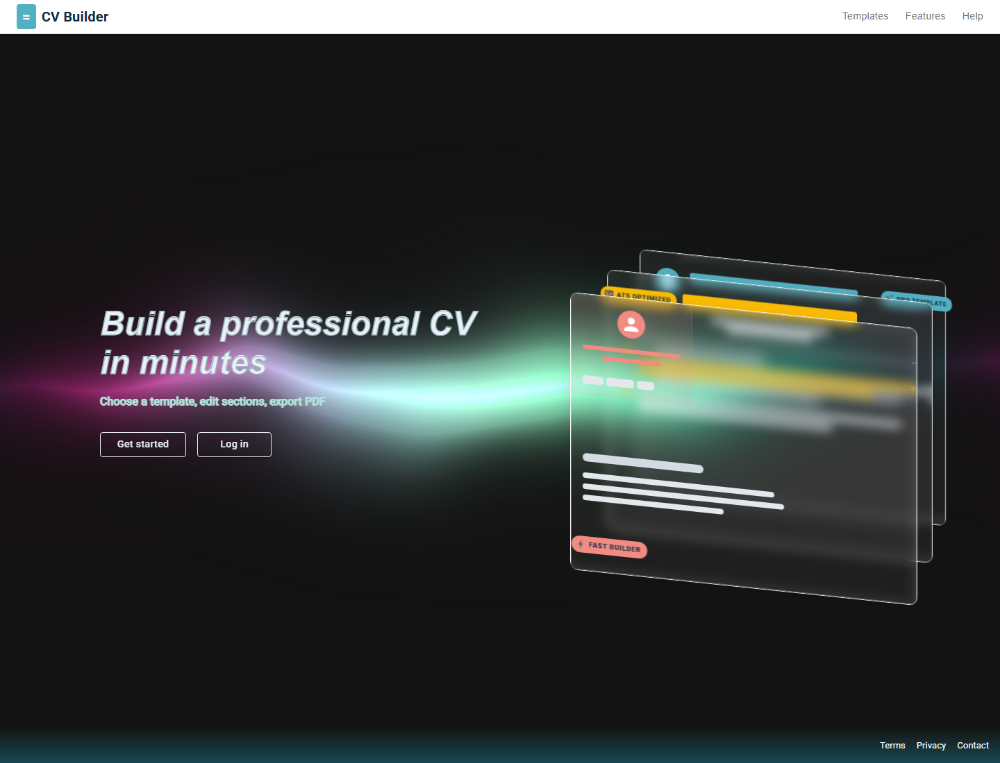
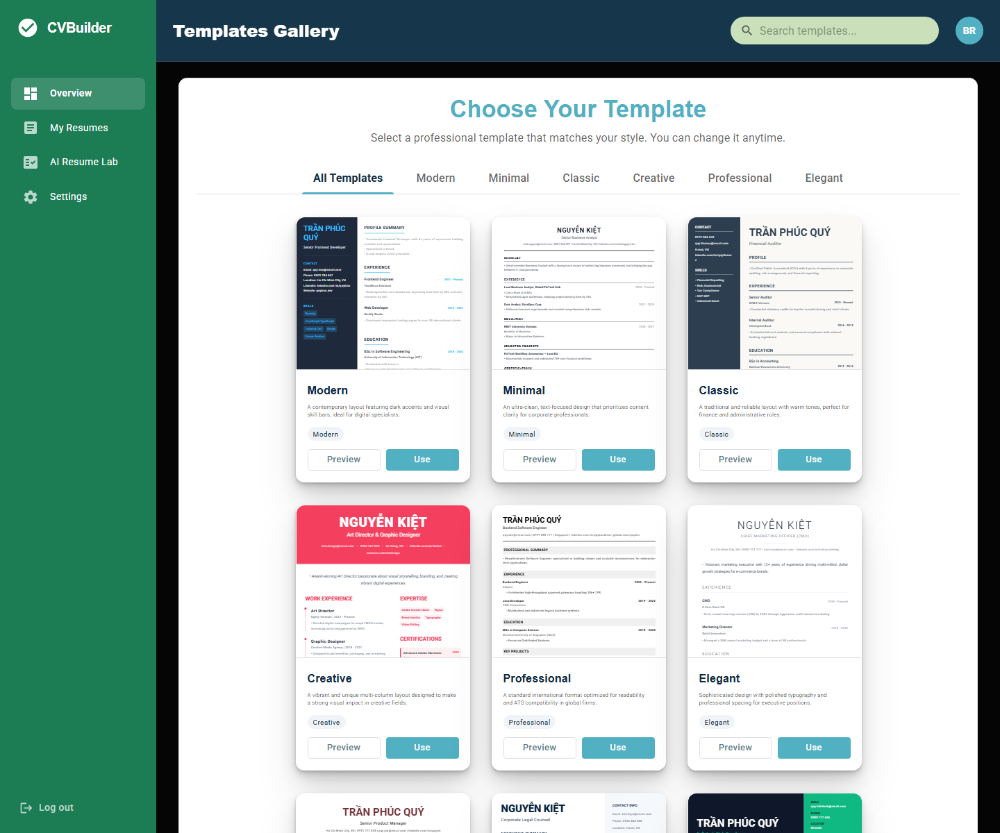
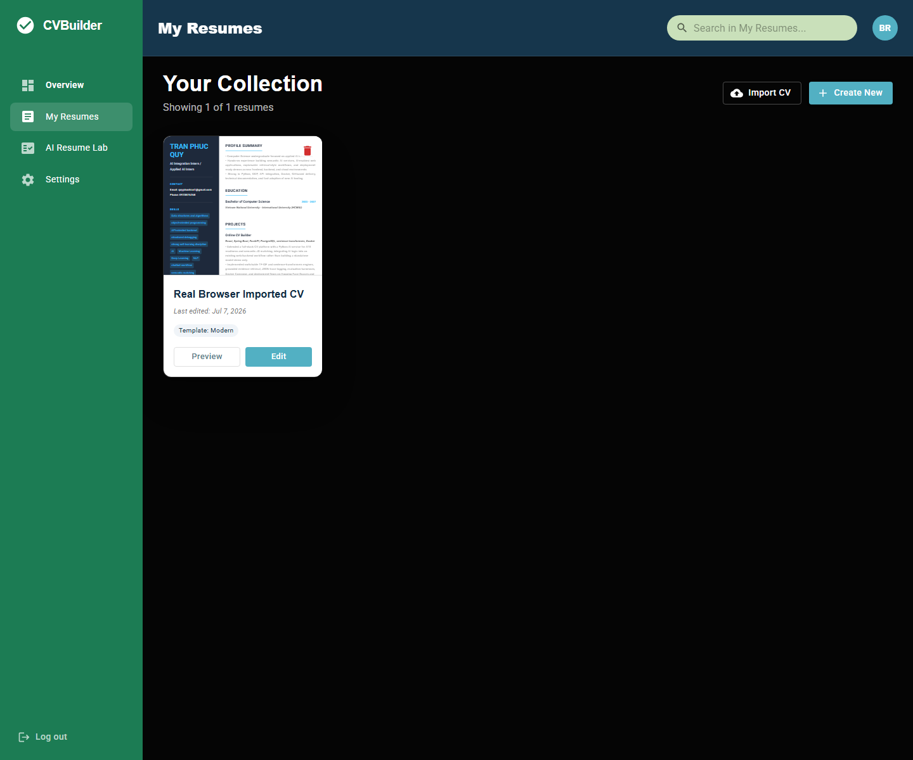
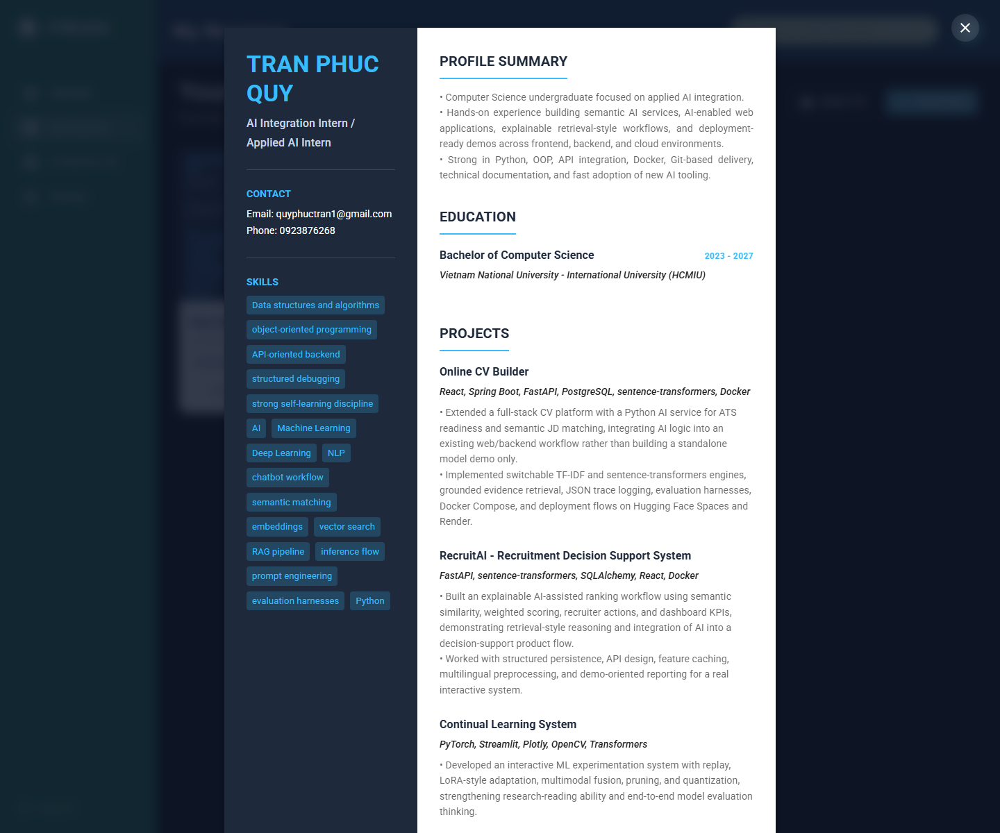
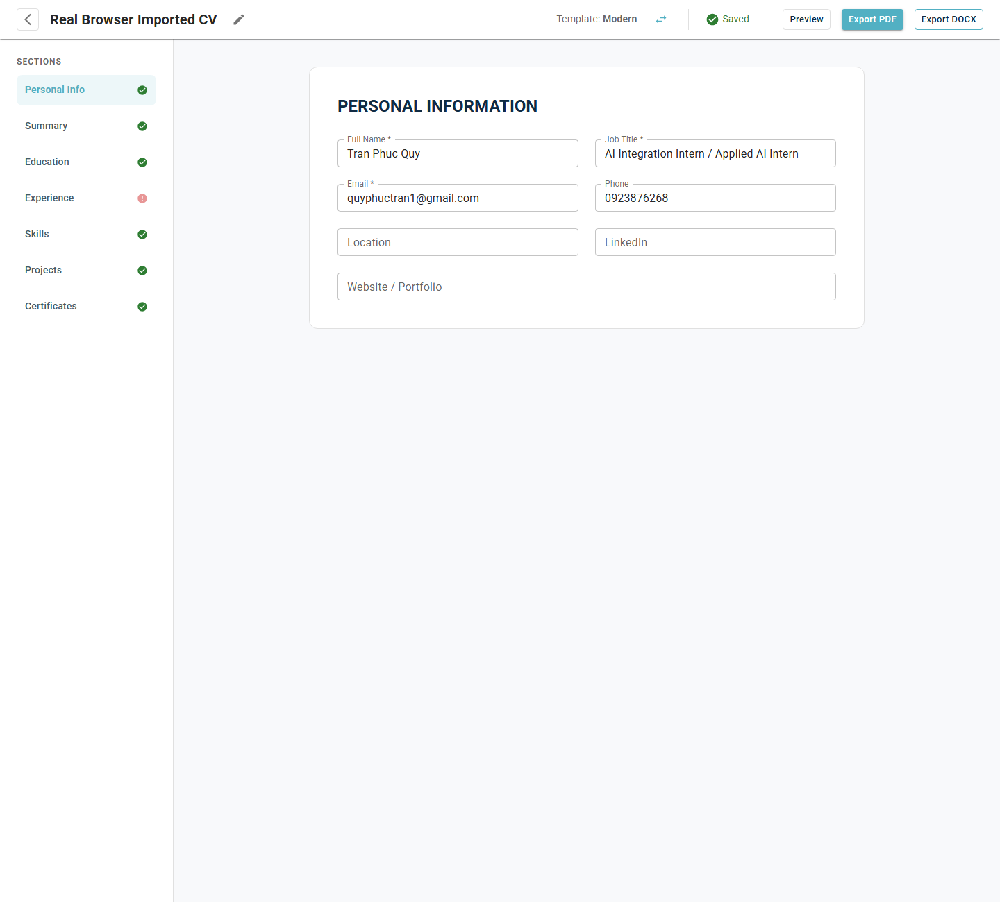
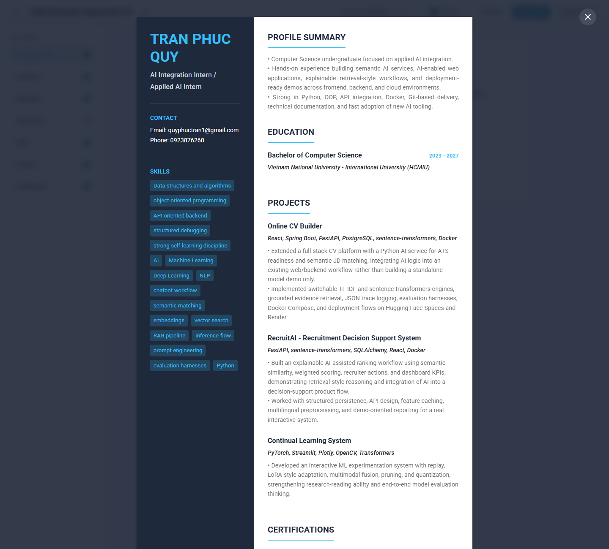
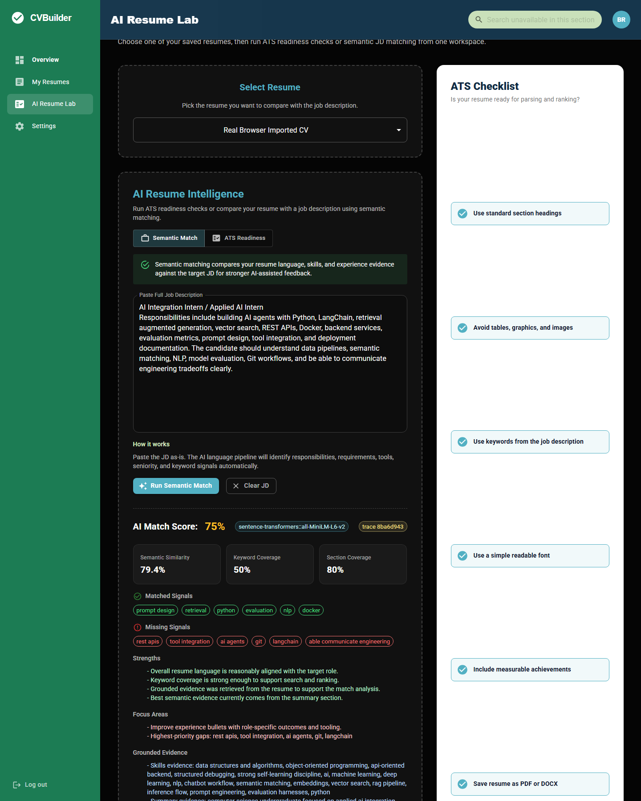
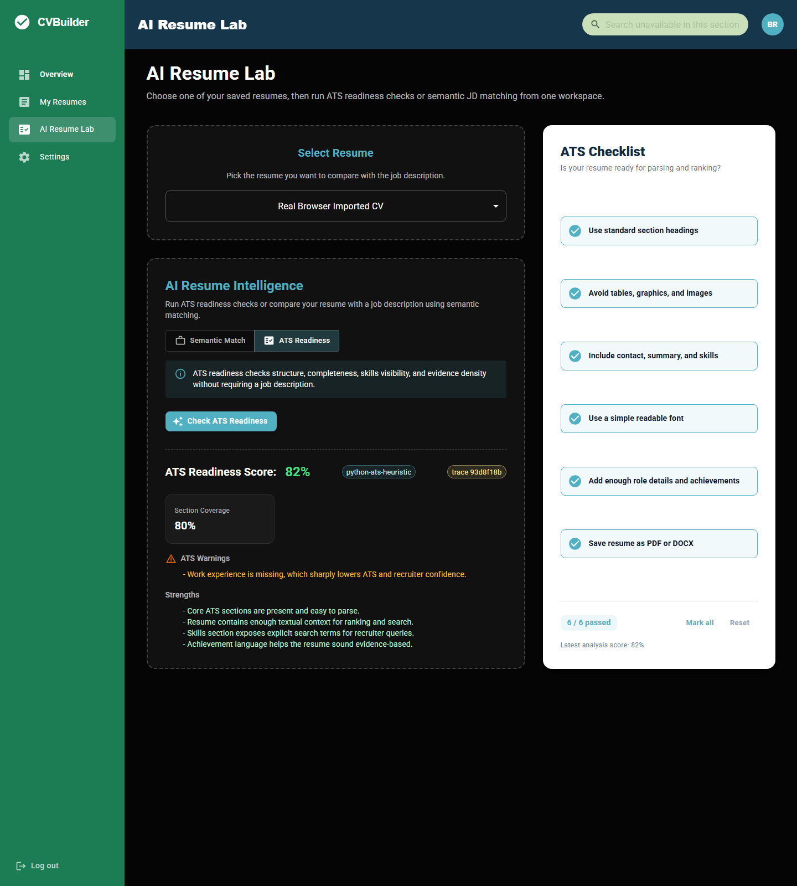

# Online CV Builder

Online CV Builder is a full-stack resume workspace for building, importing, editing, checking, and exporting CVs.

I built this project as a real product flow, not as a static CRUD demo. A user can start from a blank template or upload an existing CV, turn it into structured editable data, switch templates, preview the result, run ATS or JD matching checks, and export the final resume again.

The interesting part is the integration work: React for the product interface, Spring Boot for the secure business API, PostgreSQL for persistence, and a separate FastAPI service for CV parsing and NLP-style resume intelligence.

## Real App Screenshots

These screenshots are captured from the running local app at `http://127.0.0.1:5173`. They are not mockups.

### Landing Page



### Template Dashboard



### Imported Resume Collection



### Resume Preview



### Editor With Imported CV Data



### Editor Preview



### Semantic JD Matching



### ATS Readiness Mode



## What The App Does

- Register, log in, log out, update profile, and change password with HttpOnly-cookie authentication.
- Create CVs from templates and edit structured resume sections.
- Import an existing PDF, DOCX, TXT, or Markdown resume into editable CV data.
- Switch templates without rewriting resume content.
- Preview a CV before exporting.
- Export PDF from the frontend visual template and DOCX from backend structured data.
- Run ATS-only readiness checks.
- Paste one full job description and let the AI pipeline extract matching signals automatically.
- Compare a CV to a JD with sentence-transformers or TF-IDF fallback.
- Return matched signals, missing signals, semantic score, section coverage, keyword coverage, grounded evidence, and suggestions.

## Why This Project Exists

I wanted a portfolio project that shows the parts of AI engineering that are easy to underestimate:

- connecting AI output to a real user workflow
- keeping the product usable when the AI service is slow or unavailable
- preserving ownership checks and auth boundaries
- making import/export practical instead of decorative
- treating deployment, config, testing, and cleanup as part of the work

The result is not a giant model. It is a working applied-AI product system.

## Architecture

```text
React + Vite frontend
  - dashboard
  - editor
  - template previews
  - CV import dialog
  - AI Resume Lab
  - browser-based PDF export

Spring Boot backend
  - auth and session invalidation
  - CV CRUD with owner checks
  - import orchestration
  - DOCX/PDF export endpoints
  - AI gateway and Java fallback scoring
  - Flyway-managed schema

FastAPI AI service
  - CV text extraction and section parsing
  - ATS readiness analysis
  - semantic JD matching
  - trace logging
  - sentence-transformers or TF-IDF engines

PostgreSQL
  - users
  - templates
  - CVs and nested resume sections
```

## Tech Stack

| Layer | Tools |
| --- | --- |
| Frontend | React, Vite, Material UI, Framer Motion / Motion, html2canvas, jsPDF |
| Backend | Java 17, Spring Boot, Spring Security, Spring Data JPA, Flyway |
| Database | PostgreSQL 16 |
| AI service | FastAPI, scikit-learn, sentence-transformers, python-docx, pypdf |
| Local runtime | Docker Compose |
| Tests | JUnit, MockMvc, Maven, ESLint, Vite build, Python eval scripts |

## Run Locally With Docker

Create a local environment file:

```bash
cp .env.example .env
```

Edit `.env` before running. At minimum, set strong local values for:

```bash
POSTGRES_PASSWORD=replace-me
JWT_SECRET=replace-me-with-a-long-random-secret
```

Start the full stack:

```bash
docker compose up -d --build
```

Local URLs:

| Service | URL |
| --- | --- |
| Frontend | `http://localhost:5173` |
| Backend API | `http://localhost:8081` |
| AI service from host | `http://localhost:8001` |
| AI service inside Docker | `http://ai-service:8000` |
| PostgreSQL | `localhost:5432` |

The AI service uses host port `8001` by default so it does not collide with other local ML demos that often bind `8000`.

Stop the stack:

```bash
docker compose down
```

Reset local Docker data:

```bash
docker compose down -v
```

## Environment Variables

Required:

| Variable | Purpose |
| --- | --- |
| `POSTGRES_USER` | PostgreSQL application user |
| `POSTGRES_PASSWORD` | PostgreSQL password |
| `JWT_SECRET` | JWT signing secret, required at startup |

Common optional values:

| Variable | Default | Purpose |
| --- | --- | --- |
| `CORS_ALLOWED_ORIGINS` | `http://localhost:5173,http://127.0.0.1:5173` | Frontend origin whitelist |
| `AUTH_COOKIE_SECURE` | `false` | Set `true` behind HTTPS |
| `AUTH_COOKIE_SAME_SITE` | `Strict` | Auth cookie SameSite policy |
| `AI_SERVICE_HOST_PORT` | `8001` | Host port for FastAPI |
| `AI_SERVICE_TIMEOUT_MS` | `60000` | Semantic analysis timeout, tolerant of cold model startup |
| `AI_SERVICE_IMPORT_TIMEOUT_MS` | `60000` | CV import timeout |

The backend intentionally has no safe-looking production fallback for `JWT_SECRET` or database password. Missing secrets should fail fast.

## Manual Development

Backend:

```bash
cd backend
mvn spring-boot:run
```

Frontend:

```bash
cd frontend
npm install
npm run dev
```

AI service:

```bash
cd python-ai-service
python -m pip install -r requirements.txt
python -m uvicorn app.main:app --host 0.0.0.0 --port 8000 --reload
```

For manual backend runs, provide the same environment variables used by Docker.

## Verification

Commands I use before considering the project healthy:

```bash
cd backend
mvn test
```

```bash
cd frontend
npm run lint
npm run build
```

```bash
cd python-ai-service
python evals/run_eval.py
python -m compileall app evals
```

Docker smoke test:

```bash
docker compose up -d --build
curl http://127.0.0.1:5173/api/health
curl http://127.0.0.1:8001/health
```

Latest real test pass covered:

- registration through the real UI
- CV import using a real DOCX file
- My Resumes rendering an imported CV card
- direct editor load via `/editor/:id`
- preview modal rendering the imported resume
- semantic JD matching with `sentence-transformers::all-MiniLM-L6-v2`
- ATS readiness mode
- PDF and DOCX export endpoints
- create, update-template, and delete CV API flow
- logout redirect and stale-session rejection
- CORS whitelist behavior
- PostgreSQL schema using `TEXT` for long resume fields

## Security Notes

The app is still a portfolio project, but the security baseline is deliberately not toy-level:

- JWT is stored in an HttpOnly cookie, not in `localStorage`.
- Auth responses do not serialize the raw token back to JavaScript.
- Logout increments a per-user `tokenVersion`, invalidating older tokens.
- Password change also rotates the session version.
- Protected APIs require authenticated ownership checks.
- CORS is configured from an allowed-origin whitelist, not `*`.
- `spring.jpa.hibernate.ddl-auto` defaults to `validate`.
- Database schema and seed templates are handled by Flyway.
- `.env` is ignored; `.env.example` documents required variables without secrets.

## AI Resume Intelligence

The AI feature is designed around one simple user interaction: paste the entire job description as-is.

The service then extracts and compares:

- role language
- responsibilities
- tools and frameworks
- skills
- seniority signals
- evidence from summary, skills, projects, experience, and education

The response includes:

- overall score
- semantic similarity
- keyword coverage
- section coverage
- matched signals
- missing signals
- ATS warnings
- suggestions
- grounded evidence snippets
- trace ID

If the Python AI service is unavailable, the Java backend can still return a fallback analysis rather than crashing the product flow.

## CV Import

Import is intentionally structured, not just "dump all text into summary."

The import service attempts to recover:

- personal information
- detected role
- summary
- education
- experience
- projects
- certificates
- skills
- suggested template direction
- confidence and import insights

This works best with text-based PDFs and DOCX files. Scanned-image resumes need OCR, which is not currently included.

## Project Structure

```text
.
|-- backend/
|   |-- src/main/java/com/cvbuilder/
|   |-- src/main/resources/db/migration/
|   |-- src/test/
|   `-- pom.xml
|
|-- frontend/
|   |-- src/components/
|   |-- src/pages/
|   |-- src/services/
|   |-- src/utils/
|   `-- package.json
|
|-- python-ai-service/
|   |-- app/
|   |-- evals/
|   |-- traces/
|   `-- requirements.txt
|
|-- docs/screenshots/
|-- docker-compose.yml
|-- .env.example
`-- README.md
```

## Known Limitations

- The import pipeline does not perform OCR for scanned resumes.
- The semantic matcher is lightweight enough to run locally; it is not a proprietary hiring model and should support, not replace, human judgment.
- First sentence-transformers analysis can be slower because the model may need to load cold.
- The frontend bundle is currently large because the editor, animation, PDF, and template code ship together; code-splitting would be a good next hardening step.
- Browser PDF export is visually faithful to the rendered template. Backend DOCX export is structured and reliable, but not meant to perfectly mirror every visual template.

## What I Would Improve Next

- Add code splitting around editor, template gallery, and AI lab.
- Add OCR as an optional import path.
- Add Playwright E2E tests for the browser flows now covered manually.
- Add refresh-token rotation if this moves beyond portfolio/demo usage.
- Add a production object store for uploaded/imported file history if file retention becomes a requirement.

## Closing Note

This project is built around a simple idea: a resume builder becomes much more useful when it can understand the resume it is editing.

The work here is not only the UI, not only the API, and not only the AI service. The value is in making all three cooperate in one workflow that a real user can run end to end.
